# JWT Pizza Penetration Testing Report

## Both peers names
### **Calvin Merrell**
### **Spencer Peart**

## Self attack
### Calvin: Create an attack record for each attack.

#### Intruder Brute force Password Attack Record

| Item           | Result                                                                         |
| -------------- | ------------------------------------------------------------------------------ |
| Date           | April 09, 2026                                                                 |
| Target         | pizza.linesoflight.click                                                       |
| Classification | Brute Force                                                                    |
| Severity       | 1                                                                              |
| Description    | A login request was submitted with a blank password. The server returned HTTP 200 and issued a valid authentication token, indicating an authentication bypass caused by empty-password acceptance or improper password validation.        |
| Images         | |
| Corrections    | Reject blank passwords server-side and enforce proper password validation before issuing tokens. |

#### Sequence Auth Token Comparison Attack Record

| Item           | Result                                                                         |
| -------------- | ------------------------------------------------------------------------------ |
| Date           | April 09, 2026                                                                 |
| Target         | pizza.linesoflight.click                                                       |
| Classification | Cryptographic Failures                                                         |
| Severity       | 2                                                                              |
| Description    | Hundreds of authentication tokens were collected and compared for patterns. Observable token patterns suggest the token generation method may be predictable or insufficiently random. |
| Images         |                                  |
| Corrections    | Replace the current token creation method with a cryptographically secure library. |

#### Injecting Personal Prices Attack Record

| Item           | Result                                                                         |
| -------------- | ------------------------------------------------------------------------------ |
| Date           | April 09, 2026                                                                 |
| Target         | pizza.linesoflight.click                                                       |
| Classification | Request Manipulation                                                           |
| Severity       | 1                                                                              |
| Description    | Purchase requests were modified to include custom prices such as 0 and negative values. The server completed the purchase using the actual product price rather than the injected value. This indicates the attempted attack was not successful.|
| Images         | 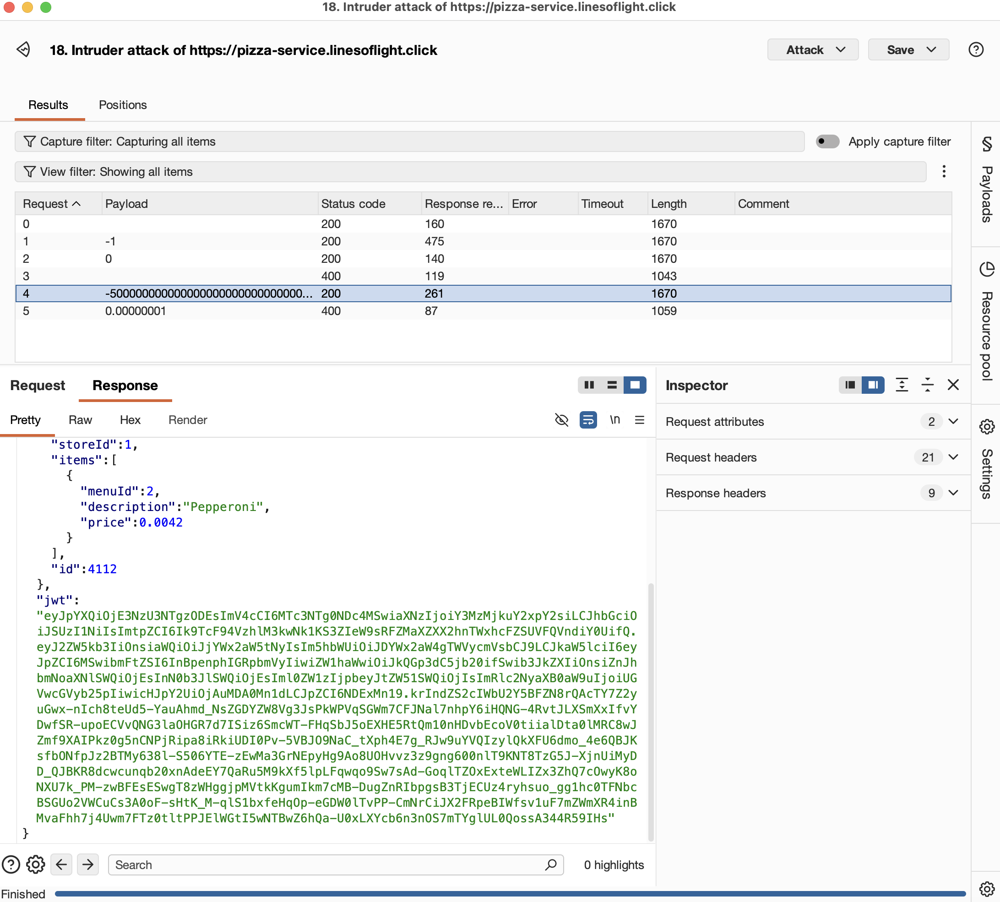 |
| Corrections    | N/A attack failed.                                                             |

#### Diner Accessing Admin Tools Attack Record

| Item           | Result                                                                         |
| -------------- | ------------------------------------------------------------------------------ |
| Date           | April 09, 2026                                                                 |
| Target         | pizza.linesoflight.click                                                       |
| Classification | Request Manipulation                                                                      |
| Severity       | 0                                                                              |
| Description    | A diner-role user attempted to delete franchises and stores without administrative privileges. The attack failed, indicating role restrictions were enforced correctly in this case. |
| Images         | 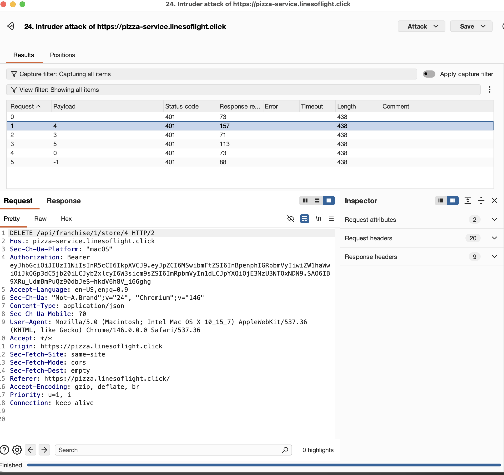 |
| Corrections    | N/A attack failed.                                                             |

#### Franchise Information Exposure Attack Record

| Item           | Result                                                                         |
| -------------- | ------------------------------------------------------------------------------ |
| Date           | April 09, 2026                                                                 |
| Target         | pizza.linesoflight.click                                                       |
| Classification | Sensitive Information Exposure / Security Misconfiguration                                                                      |
| Severity       | 1                                                                              |
| Description    | Authenticated API requests were replayed with missing and malformed bearer tokens in Burp Repeater. The application exposed framework details in response headers. Testing also suggested that malformed or zero-valued bearer tokens may have allowed access to franchise information.
| Images         |   |
| Corrections    | N/A Attack Failed                                                         |

### Self Attack: Spencer

#### Password Brute Force

| Item           | Result                                                                         |
| -------------- | ------------------------------------------------------------------------------ |
| Date           | April 09, 2026                                                                 |
| Target         | pizza.spencerpeart.uk                                                          |
| Classification | Brute Force                                                                      |
| Severity       | 3                                                                              |
| Description    | Tested brute forcing password. Blank password was able to authenticate                |
| Images         | 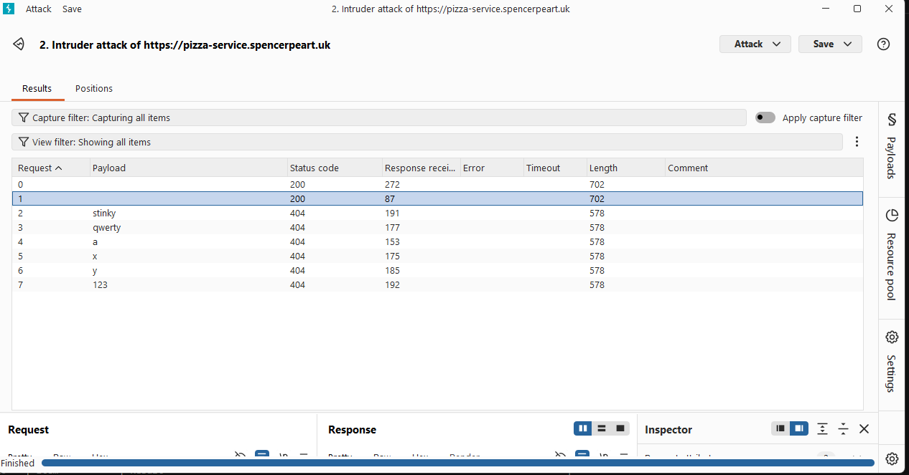 |
| Corrections    | Make blank passwords still run through all normal authentication checks.                                                          |

#### Authtoken Randomness

| Item           | Result                                                                         |
| -------------- | ------------------------------------------------------------------------------ |
| Date           | April 09, 2026                                                                 |
| Target         | pizza.spencerpeart.uk                                                          |
| Classification | Randomness Test                                                                      |
| Severity       | 2                                                                              |
| Description    | Authtoken was not being randomly generated and therefore it can be predicted.                |
| Images         |  |
| Corrections    | Ensure authtokens generated randomly                                                          |

#### Price Injection

| Item           | Result                                                                         |
| -------------- | ------------------------------------------------------------------------------ |
| Date           | April 09, 2026                                                                 |
| Target         | pizza.spencerpeart.uk                                                          |
| Classification | Price Injection                                                                      |
| Severity       | 2                                                                              |
| Description    | Able to set price of pizza in request, and effectively "steal money". Since there is not real money being transacted, it is not as big of a deal                |
| Images         | 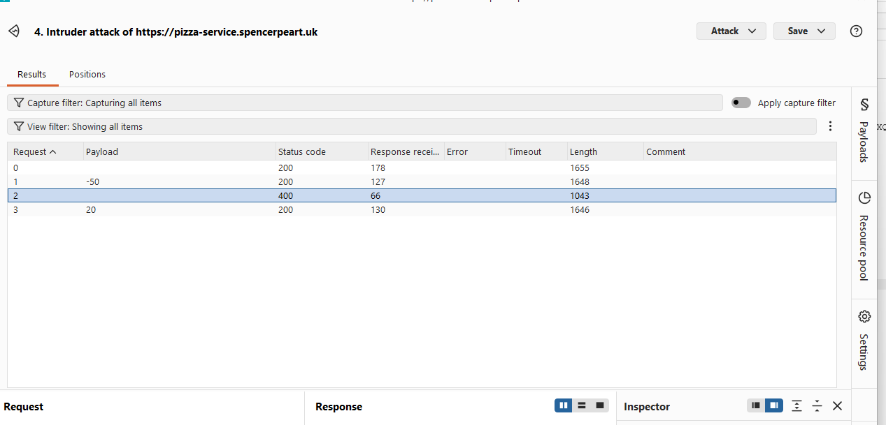  |
| Corrections    | Enforce price server side                                                          |

#### SQL Injection During Registration

| Item           | Result                                                                         |
| -------------- | ------------------------------------------------------------------------------ |
| Date           | April 09, 2026                                                                 |
| Target         | pizza.spencerpeart.uk                                                          |
| Classification | SQL Injection                                                                      |
| Severity       | 0                                                                              |
| Description    | Inject SQL into register request.                |
| Images         | 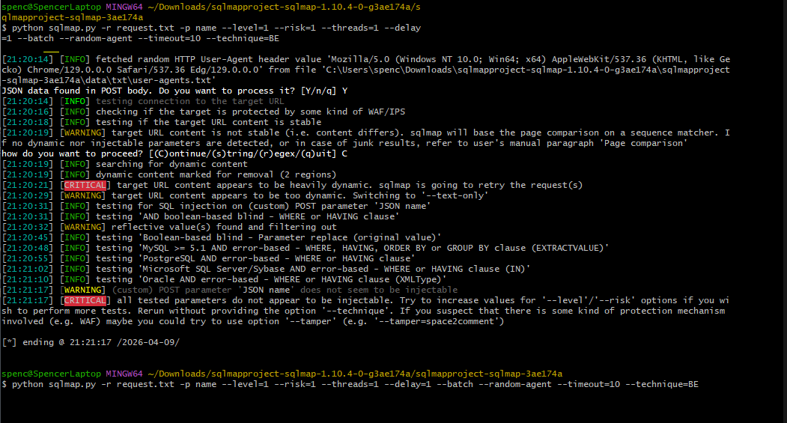  |
| Corrections    | N/A                                                         |

#### Authtoken Brute Force

| Item           | Result                                                                         |
| -------------- | ------------------------------------------------------------------------------ |
| Date           | April 09, 2026                                                                 |
| Target         | pizza.spencerpeart.uk                                                          |
| Classification | Authtoken Brute Force                                                                      |
| Severity       | 0                                                                              |
| Description    | Attempted to brute force authtoken, did not succeed.                |
| Images         |   |
| Corrections    | N/A                                                          |

## Peer attack

### Calvin attack on Spencer: Create an attack record for each attack.
#### Injecting Personal Prices Attack Record

| Item           | Result                                                                         |
| -------------- | ------------------------------------------------------------------------------ |
| Date           | April 09, 2026                                                                 |
| Target         | pizza.spencerpeart.uk                                                          |
| Classification | Request Manipulation                                                           |
| Severity       | 2                                                                              |
| Description    | Purchase requests were modified to use a price of 0 and negative values. A free pizza purchase succeeded. Negative values returned HTTP 400, but application metrics showed a value of -500000 in revenue.  |
| Images         | 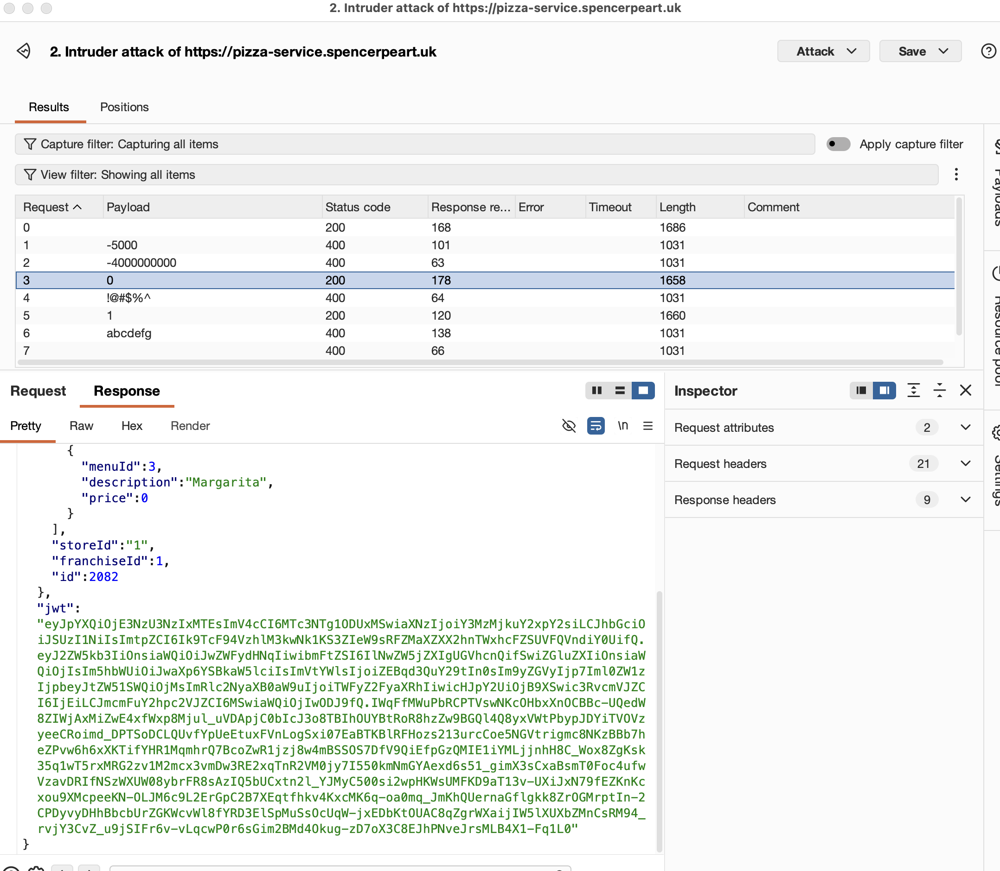|
| Corrections    | Verify all pricing on the server against database values rather than client supplied prices. |

#### Blank Password Brute Force Attack Record

| Item           | Result                                                                         |
| -------------- | ------------------------------------------------------------------------------ |
| Date           | April 09, 2026                                                                 |
| Target         | pizza.spencerpeart.uk                                                          |
| Classification | Brute Force                                                                   |
| Severity       | 2                                                                              |
| Description    | Authentication succeeded when the password field was left blank, allowing unauthorized access.|
| Images         | 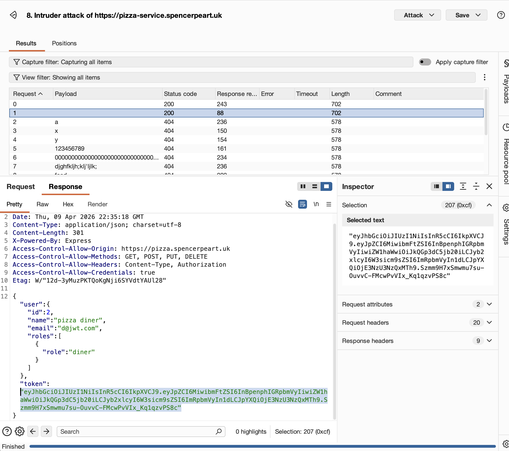|
| Corrections    | Reject blank passwords and validate authentication requests before issuing access tokens.|

#### Franchise Deletion Without Valid Auth Token Attack Record

| Item           | Result                                                                         |
| -------------- | ------------------------------------------------------------------------------ |
| Date           | April 09, 2026                                                                 |
| Target         | pizza.spencerpeart.uk                                                          |
| Classification | Auth Token Manipulation                                                        |
| Severity       | 4                                                                              |
| Description    | A request to delete a franchise succeeded without a valid authentication token. The primary franchise and stores were deleted using a fake token. |
| Images         | 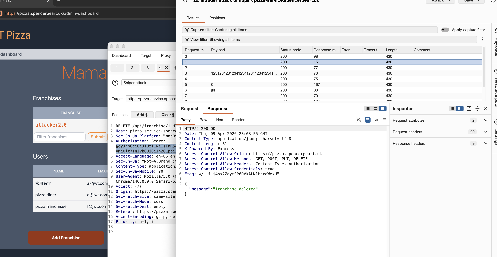 |
| Corrections    | Require valid authentication and authorization checks for franchise deletion endpoints. |

#### Auth Token Pattern Analysis Attack Record

| Item           | Result                                                                         |
| -------------- | ------------------------------------------------------------------------------ |
| Date           | April 09, 2026                                                                 |
| Target         | pizza.spencerpeart.uk                                                          |
| Classification | Cryptographic Failures                                                         |
| Severity       | 2                                                                              |
| Description    | Hundreds of authentication tokens were collected and compared. Patterns were identified, suggesting potentially weak token generation. |
| Images         |     |
| Corrections    | Use a cryptographically secure token generation library with sufficient varriation.|

#### Registration Insertion Attack Record

| Item           | Result                                                                         |
| -------------- | ------------------------------------------------------------------------------ |
| Date           | April 09, 2026                                                                 |
| Target         | pizza.spencerpeart.uk                                                          |
| Classification | Brute Force / Insertion                                                        |
| Severity       | 0                                                                              |
| Description    | Registration of many users with SQL and code in their names and emails. The database was not affected; however, odd behavior occurred during email handling. The "." was displayed incorrectly |
| Images         |  |
| Corrections    | Sanitize and validate user-supplied input during registration.                 |

### Spencer Attack on Calvin.
#### Password Brute Force

| Item           | Result                                                                         |
| -------------- | ------------------------------------------------------------------------------ |
| Date           | April 09, 2026                                                                 |
| Target         | pizza.linesoflight.click                                                       |
| Classification | Brute Force Password Discovery                                                 |
| Severity       | 0                                                                              |
| Description    | Brute Force Password attempts on backend service, did not succeed              |
| Images         | 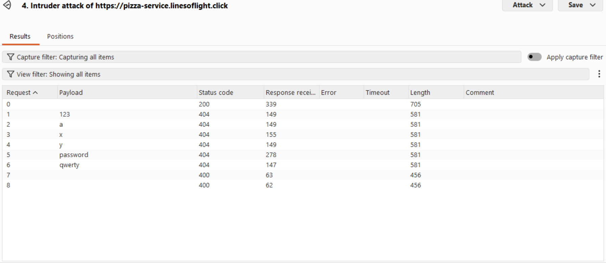 |
| Corrections    | N/A                                                                            |

#### Authtoken Randomness

| Item           | Result                                                                         |
| -------------- | ------------------------------------------------------------------------------ |
| Date           | April 09, 2026                                                                 |
| Target         | pizza.linesoflight.click                                                       |
| Classification | Authtoken Randomness                                                            |
| Severity       | 2                                                                              |
| Description    | Tested the randomness of given auth tokens to see if they can be predicted                |
| Images         | 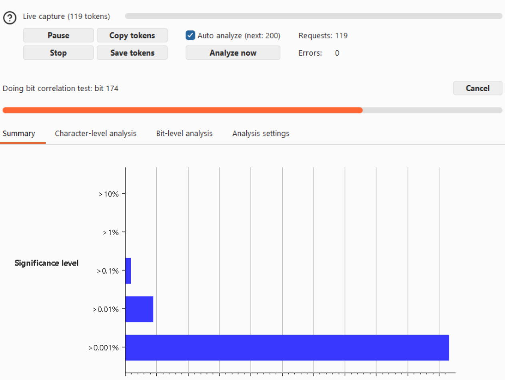  |
| Corrections    | Make authtoken generation random                                                          |

#### Pizza Purchase Authtoken Substitution 

| Item           | Result                                                                         |
| -------------- | ------------------------------------------------------------------------------ |
| Date           | April 09, 2026                                                                 |
| Target         | pizza.linesoflight.click                                                       |
| Classification | Brute Force Pizza Purchase authtoken                                                       |
| Severity       | 0                                                                              |
| Description    | Tried to buy a pizza with variations is place of the correct token. Did not work.           |
| Images         | 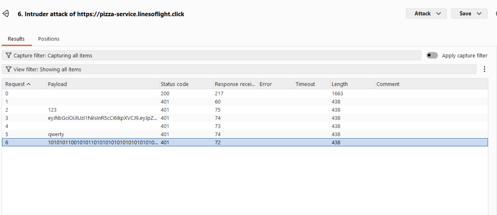  |
| Corrections    | N/A                                                          |

#### SQL Injection

| Item           | Result                                                                         |
| -------------- | ------------------------------------------------------------------------------ |
| Date           | April 09, 2026                                                                 |
| Target         | pizza.linesoflight.click                                                       |
| Classification | Injection                                                                      |
| Severity       | 0                                                                             |
| Description    | SQL injection attempt, was not able to inject any SQL using sqlMap.                |
| Images         | 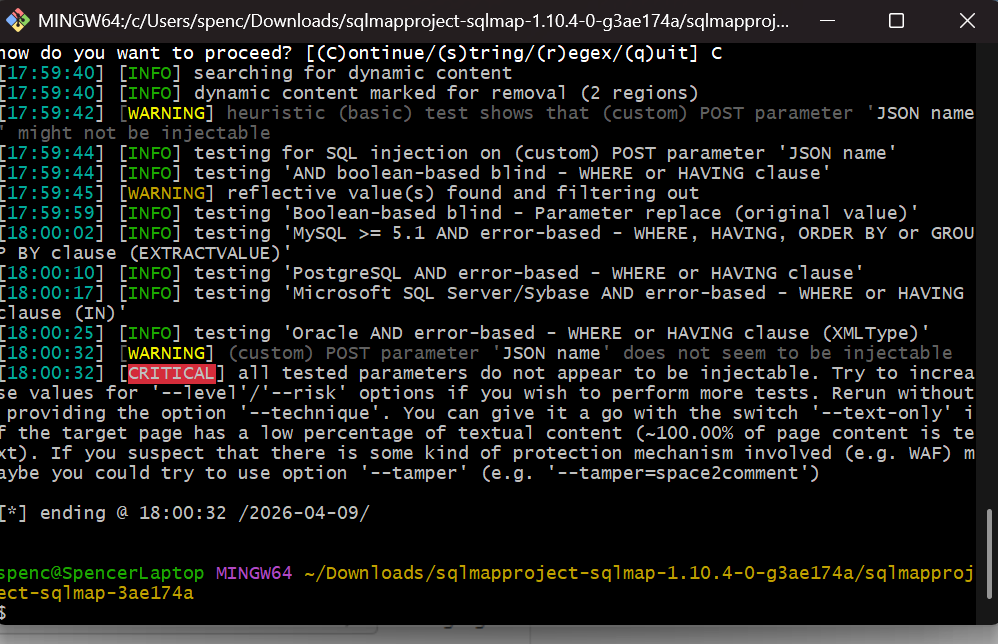   Stores and menu no longer accessible. |
| Corrections    | N/A                                                        |

#### Pricing Adjustment Insertion

| Item           | Result                                                                         |
| -------------- | ------------------------------------------------------------------------------ |
| Date           | April 09, 2026                                                                 |
| Target         | pizza.linesoflight.click                                                       |
| Classification | Brute Force                                                                       |
| Severity       | 0                                                                              |
| Description    | Did not allow the changing of pizza price from the user end                |
| Images         | 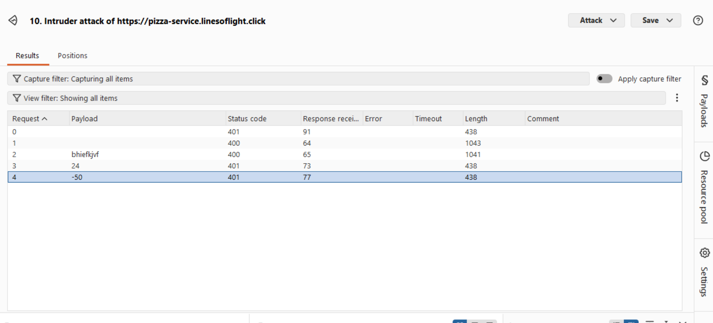  |
| Corrections    | N/A                                                          |

## Combined summary of learnings
This report shows how important database security really is. Access should always be properly checked, and important information should be confirmed by the database instead of trusting user input or values stored on the front end. Strong server-side validation helps prevent unauthorized access and misuse of data. It is important that Devops tests for such vulnerabilities so the responsibility of system security is shared among both teams if they are separate. It is difficult to consider every avenue for attack so everyone working together will give the maximum amount of security.

